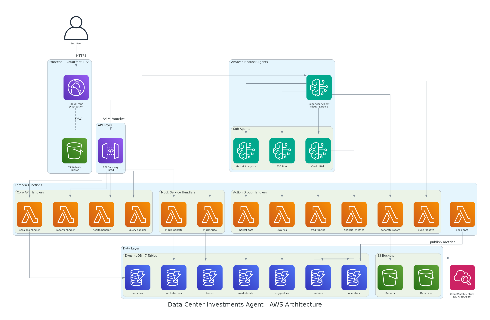

# Data Center Investments Agent

AI-powered multi-agent system for data center sector investment analysis, built on AWS Bedrock Agents with Mistral Large 3.

A Supervisor Agent routes natural language queries to specialist sub-agents — Credit Risk, Market Analytics, and ESG Risk — each backed by Lambda action groups that query DynamoDB-stored financial data for operators such as Equinix, Digital Realty, QTS, and CyrusOne. Mock integrations for Workato (iPaaS) and Arize (LLM observability) simulate production data pipelines and monitoring without third-party dependencies.

Prompt to demo using Coder Agents:
`Analyze the Product Requirements at https://github.com/greg-the-coder/aws-coder-agentic-ai-showcase/tree/main/product-docs and create a technical design, implementation plan, and MVP demo application deployed to AWS, mocking 3rd-Party integrations with Workato and Arize.`

---

## Architecture



The system is deployed across five tiers in **us-east-1**, each represented in the diagram above:

### Frontend — CloudFront + S3

A **CloudFront Distribution** serves the React SPA from a private **S3 Website Bucket** via Origin Access Control (OAC). CloudFront also proxies `/v1/*` and `/mock/*` requests to the API tier, giving the frontend a single domain for both static assets and API calls. The SPA itself includes four panels: Chat, Portfolio Dashboard, Workato, and Arize.

### API Layer

An **API Gateway** REST API (`/prod` stage) exposes all backend routes. Core endpoints live under `/v1/*` (query, health, sessions, reports) while mock third-party services are under `/mock/workato` and `/mock/arize`.

### Lambda Functions

Thirteen **Lambda** functions (Python 3.12) handle all compute:

- **Core API Handlers** — `query handler`, `health handler`, `sessions handler`, and `reports handler` serve the `/v1/*` routes.
- **Mock Service Handlers** — `mock Workato` and `mock Arize` simulate iPaaS and LLM observability without external dependencies.
- **Action Group Handlers** — Six functions (`credit rating`, `financial metrics`, `market data`, `ESG risk`, `generate report`, `sync Moodys`) are wired as Bedrock Agent action groups.
- **Seed** — A standalone `seed data` function populates DynamoDB with operator data for six data center companies.

### Amazon Bedrock AgentCore

A **Supervisor Agent** powered by Mistral Large 3 (675B) uses the Supervisor Router pattern to dispatch queries to three specialist **Sub-Agents**: Credit Risk, Market Analytics, and ESG Risk. Each sub-agent invokes its corresponding action group Lambdas and the Supervisor synthesizes cross-domain responses when needed.

### Data Layer

- **DynamoDB (7 tables)** — `sessions`, `operators`, `metrics`, `esg-profiles`, `market-data`, `traces`, and `workato-runs` store all application state with on-demand billing.
- **S3 (2 buckets)** — A Data Lake bucket for raw data and a Reports bucket for generated investment reports.
- **CloudWatch Metrics** — The mock Arize handler publishes `TraceLatency` and `TokenCount` metrics to the `DCInvestAgent` custom namespace for observability.

---

## Features

- **Bedrock AgentCore with Mistral Large 3** — Natural language investment analysis powered by a 675B parameter model via multi-agent collaboration (Supervisor Router pattern)
- **6 Action Groups** — Credit Rating lookup, Financial Metrics, Market Data, ESG Risk assessment, Report Generation, Moody's Sync
- **Mock Workato Integration** — iPaaS simulation with recipe triggering, status polling, webhook ingestion, and connection health checks
- **Mock Arize Integration** — LLM observability simulation with trace storage, evaluation metrics, latency/token tracking, and CloudWatch metric publishing
- **React Frontend** — Chat interface, portfolio dashboard, Workato panel, and Arize panel (Vite + TypeScript + Tailwind CSS)
- **Infrastructure as Code** — 4 CDK stacks covering data, Lambda, API Gateway, and Bedrock Agent resources

---

## Project Structure

```
aws-coder-agentic-ai-showcase/
├── infrastructure/               # AWS CDK (Python)
│   ├── app.py                    # CDK app entry point
│   ├── cdk.json
│   ├── requirements.txt
│   └── lib/
│       ├── data_stack.py         # DynamoDB tables, S3 buckets
│       ├── lambda_stack.py       # All Lambda functions
│       ├── api_stack.py          # API Gateway REST API
│       └── agent_stack.py        # Bedrock Agent + action groups
├── lambda/
│   ├── action_groups/            # Bedrock Agent action group handlers
│   │   ├── handlers/
│   │   │   ├── credit_rating.py
│   │   │   ├── financial_metrics.py
│   │   │   ├── market_data.py
│   │   │   ├── esg_risk.py
│   │   │   ├── generate_report.py
│   │   │   └── sync_moodys.py
│   │   └── shared/               # DB helpers, tracing, models
│   ├── api/                      # API Lambda handlers
│   │   ├── query_handler.py      # POST /v1/query
│   │   ├── health_handler.py     # GET  /v1/health
│   │   ├── sessions_handler.py   # GET  /v1/sessions/{id}
│   │   └── reports_handler.py    # POST /v1/reports/generate
│   ├── mock_services/
│   │   ├── workato/handler.py    # Mock Workato iPaaS
│   │   └── arize/handler.py      # Mock Arize observability
│   ├── mocks/                    # Lightweight mock stubs
│   └── seed/                     # Data seeding scripts
├── schemas/                      # OpenAPI specs for action groups
├── prompts/                      # Agent system prompts
│   ├── supervisor_system.txt
│   ├── credit_risk_system.txt
│   ├── market_analytics_system.txt
│   └── esg_risk_system.txt
├── frontend/                     # React SPA
│   ├── package.json
│   ├── vite.config.ts
│   └── src/
│       ├── App.tsx
│       ├── components/
│       └── services/
├── docs/                         # Design documents
│   ├── TECHNICAL_DESIGN.md
│   └── IMPLEMENTATION_PLAN.md
└── product-docs/                 # PRD, data model, technical spec
```

---

## Prerequisites

| Tool | Version | Purpose |
|------|---------|---------|
| AWS CLI | v2 | Account authentication and resource management |
| AWS CDK | >= 2.150.0 | Infrastructure deployment |
| Node.js | >= 18 | Frontend build tooling |
| Python | 3.12 | CDK stacks and Lambda runtime |
| pip | latest | Python dependency management |

You also need an AWS account with permissions for Bedrock, DynamoDB, S3, Lambda, API Gateway, CloudWatch, and IAM.

---

## Quick Start

### 1. Clone and install dependencies

```bash
git clone <repo-url>
cd aws-coder-agentic-ai-showcase

# CDK dependencies
cd infrastructure
python -m venv .venv
source .venv/bin/activate
pip install -r requirements.txt

# Frontend dependencies
cd ../frontend
npm install
```

### 2. Bootstrap CDK (first time only)

```bash
cd infrastructure
cdk bootstrap aws://<ACCOUNT_ID>/us-east-1
```

### 3. Deploy all stacks

```bash
cd infrastructure
cdk deploy --all --require-approval never
```

This deploys four stacks in order:

| Stack | Resources |
|-------|-----------|
| `DcaiDataStack` | 7 DynamoDB tables, 2 S3 buckets |
| `DcaiLambdaStack` | API handlers, action group handlers, mock service handlers, seed function |
| `DcaiApiStack` | REST API Gateway with `/v1/*` and `/mock/*` routes |
| `DcaiAgentStack` | Bedrock Agent (Supervisor + sub-agents), action group wiring |

### 4. Seed mock data

Invoke the seed Lambda after deployment to populate DynamoDB with operator data for 6 data center companies:

```bash
aws lambda invoke --function-name dcai-seed --payload '{}' /dev/stdout
```

### 5. Build and serve the frontend

```bash
cd frontend
npm run build    # Production build
npm run dev      # Local dev server at http://localhost:5173
```

Set the API base URL in the frontend by creating a `.env` file:

```
VITE_API_URL=https://xqh1jxcqh7.execute-api.us-east-1.amazonaws.com/prod
```

---

## API Reference

**Base URL:** `https://xqh1jxcqh7.execute-api.us-east-1.amazonaws.com/prod`

### Core Endpoints

#### `POST /v1/query` — Submit a natural language query

```bash
curl -X POST https://xqh1jxcqh7.execute-api.us-east-1.amazonaws.com/prod/v1/query \
  -H "Content-Type: application/json" \
  -d '{"session_id": "demo-001", "message": "What is the credit rating for Equinix?"}'
```

Response:
```json
{
  "session_id": "demo-001",
  "response": "Based on Moody's latest assessment, Equinix Inc. (EQIX) maintains an A3 issuer rating...",
  "source": "bedrock-agent",
  "latency_ms": 3241.5,
  "timestamp": "2025-07-14T12:00:00Z"
}
```

#### `GET /v1/sessions/{id}` — Retrieve session history

```bash
curl https://xqh1jxcqh7.execute-api.us-east-1.amazonaws.com/prod/v1/sessions/demo-001
```

#### `GET /v1/health` — Service health check

```bash
curl https://xqh1jxcqh7.execute-api.us-east-1.amazonaws.com/prod/v1/health
```

#### `POST /v1/reports/generate` — Generate an investment report

```bash
curl -X POST https://xqh1jxcqh7.execute-api.us-east-1.amazonaws.com/prod/v1/reports/generate \
  -H "Content-Type: application/json" \
  -d '{"operator": "Equinix", "report_type": "credit_summary"}'
```

### Mock Workato Endpoints

#### `POST /mock/workato/recipes/{recipe_id}/trigger` — Trigger a recipe

```bash
curl -X POST https://xqh1jxcqh7.execute-api.us-east-1.amazonaws.com/prod/mock/workato/recipes/moodys_sync/trigger \
  -H "Content-Type: application/json" \
  -d '{"source": "api"}'
```

#### `GET /mock/workato/recipes/{recipe_id}/status` — Recipe run status

```bash
curl https://xqh1jxcqh7.execute-api.us-east-1.amazonaws.com/prod/mock/workato/recipes/moodys_sync/status
```

#### `POST /mock/workato/webhooks/moodys-rating-action` — Simulate Moody's webhook

```bash
curl -X POST https://xqh1jxcqh7.execute-api.us-east-1.amazonaws.com/prod/mock/workato/webhooks/moodys-rating-action \
  -H "Content-Type: application/json" \
  -d '{"issuer": "Equinix", "action": "upgrade", "new_rating": "A2"}'
```

#### `GET /mock/workato/connections` — List mock connections

```bash
curl https://xqh1jxcqh7.execute-api.us-east-1.amazonaws.com/prod/mock/workato/connections
```

### Mock Arize Endpoints

#### `POST /mock/arize/traces` — Ingest a trace span

```bash
curl -X POST https://xqh1jxcqh7.execute-api.us-east-1.amazonaws.com/prod/mock/arize/traces \
  -H "Content-Type: application/json" \
  -d '{"trace_id": "t-001", "latency_ms": 2500, "token_count": 350, "model": "mistral-large"}'
```

#### `GET /mock/arize/evaluations` — LLM evaluation results

```bash
curl https://xqh1jxcqh7.execute-api.us-east-1.amazonaws.com/prod/mock/arize/evaluations
```

#### `GET /mock/arize/metrics` — Aggregated performance metrics

```bash
curl https://xqh1jxcqh7.execute-api.us-east-1.amazonaws.com/prod/mock/arize/metrics
```

#### `GET /mock/arize/dashboard` — Dashboard summary

```bash
curl https://xqh1jxcqh7.execute-api.us-east-1.amazonaws.com/prod/mock/arize/dashboard
```

---

## Demo Scenarios

Try these queries to exercise the agent's capabilities:

### 1. Credit Risk Analysis

```
What is the credit rating and default probability for Equinix?
```

The Supervisor routes to the Credit Risk sub-agent, which invokes `LookupCredit` and `GetFinancial` action groups to return Moody's ratings, debt-to-EBITDA, interest coverage, and probability of default.

### 2. Market Supply/Demand

```
Compare vacancy rates and pricing across Northern Virginia and Dallas data center markets.
```

Routes to the Market Analytics sub-agent, which queries `QueryMarket` for supply, demand, vacancy, construction pipeline, and pricing data.

### 3. ESG Sustainability Comparison

```
Which operator has the best PUE and renewable energy usage?
```

Routes to the ESG Risk sub-agent, which invokes `AssessESG` to compare power usage effectiveness, carbon intensity, and renewable energy sourcing across all operators.

### 4. Cross-Domain Portfolio Query

```
Give me a full investment overview for Digital Realty — credit, market position, and ESG profile.
```

The Supervisor fans out to all three sub-agents and synthesizes a unified investment brief.

### 5. Data Pipeline Trigger

```bash
# Trigger the Moody's sync recipe, then check status:
curl -X POST .../mock/workato/recipes/moodys_sync/trigger -d '{"source":"demo"}'
curl .../mock/workato/recipes/moodys_sync/status
```

---

## Mock Services

### Mock Workato (iPaaS Simulation)

Simulates a Workato iPaaS environment without requiring a Workato license. The mock Lambda returns realistic Workato API envelope formats so swapping in a live Workato instance is a configuration change.

| Capability | What It Does |
|------------|-------------|
| Recipe Trigger | Accepts `POST`, creates a job record in `dcai-workato-runs` DynamoDB table, returns a `job_id` |
| Status Polling | Returns mock `succeeded` status with run metrics (duration, records processed, steps) |
| Moody's Webhook | Simulates an incoming rating-action event; stores the payload in DynamoDB |
| Connection Health | Returns 4 mock connections (Moody's CreditView, AWS S3, Salesforce, Slack) with `active` status |

### Mock Arize (LLM Observability Simulation)

Simulates Arize's LLM monitoring platform without requiring an Arize account. Traces are stored in DynamoDB (`dcai-traces`) and metrics are published to CloudWatch under the `DCInvestAgent` namespace.

| Capability | What It Does |
|------------|-------------|
| Trace Ingestion | Stores trace spans in DynamoDB; publishes `TraceLatency` and `TokenCount` to CloudWatch |
| Trace Retrieval | Fetches a stored trace by ID |
| Evaluations | Returns randomized but realistic scores for relevance, faithfulness, toxicity, and latency |
| Metrics | Returns p50/p95/p99 latency, token usage, throughput, quality scores, and estimated cost |
| Dashboard | Returns time-series trace data, per-model performance, alert status, and embedding drift |

---

## Tech Stack

| Layer | Technology |
|-------|-----------|
| LLM | Mistral Large 3 (675B Instruct) via AWS Bedrock |
| Agent Framework | AWS Bedrock Agents (Supervisor Router) |
| Compute | AWS Lambda (Python 3.12) |
| API | Amazon API Gateway (REST) |
| Database | Amazon DynamoDB (7 tables, on-demand billing) |
| Storage | Amazon S3 (data lake + reports) |
| Observability | CloudWatch (custom metrics namespace `DCInvestAgent`) |
| IaC | AWS CDK v2 (Python) |
| Frontend | React 18, Vite 6, TypeScript, Tailwind CSS |
| Charts | Recharts |
| Region | us-east-1 |

### Deployed Resources

| Resource | Identifier |
|----------|-----------|
| API Gateway | `https://xqh1jxcqh7.execute-api.us-east-1.amazonaws.com/prod/` |
| Bedrock Agent | `TCAPMQHNOY` (Alias: `ISRQWCUJVT`) |
| DynamoDB Tables | `dcai-sessions`, `dcai-operators`, `dcai-metrics`, `dcai-esg-profiles`, `dcai-market-data`, `dcai-traces`, `dcai-workato-runs` |
| S3 Data Lake | `dcaidatastack-datalakebucket0256ea8e-edp2hjettfb7` |
| S3 Reports | `dcaidatastack-reportsbucket4e7c5994-oiqnnizx3yjo` |

---

## Cleanup

Destroy all deployed resources:

```bash
cd infrastructure
cdk destroy --all
```

This removes all four stacks (`DcaiAgentStack`, `DcaiApiStack`, `DcaiLambdaStack`, `DcaiDataStack`) and their resources. DynamoDB tables use `DESTROY` removal policy — all data will be deleted.

---

## License

See [LICENSE](./LICENSE).
